# Marmarkos ABNUB — Database Design

Production database: **PostgreSQL 16** on **Neon** (serverless). Local development and
CI use a disposable Docker PostgreSQL on port 55432.

## Stack & Conventions

| Concern | Choice |
|---|---|
| ORM | SQLAlchemy 2.0 async (`sqlalchemy.ext.asyncio`), asyncpg driver |
| Migrations | Alembic (async `env.py`, `alembic.ini`) |
| PKs | `UUID` (Python-side `uuid.uuid4()` default) |
| Timestamps | `timestamptz` (`DateTime(timezone=True)`), stored/compared in UTC, `server_default=func.now()` |
| Enums | `StrEnum` in `app/modules/*/domain/enums/`, stored as VARCHAR via `native_enum=False` (portable between Neon and local PG) |
| JSON | `JSONB` for flexible payloads (`notifications.data`, `audit_logs.metadata`, `outbox_events.payload`) |
| Transactions | `UnitOfWork` — one transaction per request/worker task; repositories mutate objects, `commit()` flushes |
| Outbox | Domain events written to `outbox_events` **in the same transaction** as the aggregate change; worker claims with `FOR UPDATE SKIP LOCKED` |

All 18 tables live on a single `Base.metadata` (`app/shared/infrastructure/persistence/registry.py`),
so tests, Alembic autogenerate, and `create_all` always see the same schema.

## Tables by Module

### users (`users` module)
| Table | Purpose |
|---|---|
| `roles` | MEMBER / SERVANT / ADMIN (INT PK, seeded in migration `60db6157691a`) |
| `users` | Email (unique), phone (unique, nullable), first/last name, avatar, `public_id`, `status`, `role_id`, `last_login_at` |
| `user_qr_codes` | QR attendance tokens. Only the **SHA-256 hash** is stored (`token_hash`, unique). Rotation = new row; partial unique index `uq_user_qr_codes_active_user` guarantees at most **one active token per user**. No personal data inside the QR payload |
| `user_ban_records` | Append-only ban history: reason, banned_by, banned_until, lifted_at/lifted_by |

### auth (`auth` module)
| Table | Purpose |
|---|---|
| `refresh_tokens` | Refresh sessions. Only **hash** stored (`token_hash`, unique), with `expires_at`, `revoked_at`, `user_agent`, `ip_address` |

### attendance (`attendance` module)
| Table | Purpose |
|---|---|
| `service_sessions` | One row per service (name, date, start/end time, `service_type` SUNDAY_SERVICE / LITURGY / BIBLE_STUDY / YOUTH / PRAYER_MEETING, `is_active`) |
| `attendance_records` | `user_id`, `session_id`, **denormalized** `attendance_date` (indexed, powers daily/weekly/monthly analytics), `scanned_at`, `scanned_by`, `method` (QR_SCAN / MANUAL), notes. Unique `(user_id, session_id)` → no double-counting |

### blog (`blog` module)
| Table | Purpose |
|---|---|
| `blog_posts` | Title, unique `slug`, excerpt, content, cover_image, `status` (DRAFT / PUBLISHED / ARCHIVED), `published_at` |
| `blog_categories` | name (unique), slug (unique), description |
| `blog_post_categories` | M2M join table |
| `blog_post_likes` | Unique `(post_id, user_id)`; toggle = physical delete + insert (`INSERT ... ON CONFLICT DO NOTHING`) |

### comments (`comments` module)
| Table | Purpose |
|---|---|
| `comments` | Self-referencing `parent_comment_id` for threaded replies. `status` VISIBLE / HIDDEN / DELETED — **comments are never physically deleted** (soft moderation preserves accountability) |

### notifications (`notifications` module)
| Table | Purpose |
|---|---|
| `notifications` | Per-user rows; `user_id IS NULL` = broadcast to everyone. `type` (ATTENDANCE, SYSTEM, ANNOUNCEMENT, BLOG_POST), `data` JSONB, `read_at` |

### anonymous_messages (`anonymous_messages` module)
| Table | Purpose |
|---|---|
| `anonymous_messages` | Message + lifecycle state only: `status` PENDING/SENT/FAILED, `telegram_status` PENDING/SENT/FAILED, `telegram_message_id`, `failure_reason`. **No identity columns exist by design** — verified by test `test_table_has_no_identity_columns` |

### bible (`bible` module)
| Table | Purpose |
|---|---|
| `bible_verses` | `verse_reference`, `text`, `translation`, `week_start_date`, `is_published`. Partial unique index `uq_bible_verses_published_week` → at most one **published** verse per week (drafts allowed) |

### media (`media` module)
| Table | Purpose |
|---|---|
| `media_assets` | Metadata + URL only (no binary storage): `name`, `type` (IMAGE/VIDEO/DOCUMENT), `url`, `alt_text`, `section`, `sort_order`, `is_active`, `created_by` |

### admin (`admin` module)
| Table | Purpose |
|---|---|
| `audit_logs` | Append-only admin actions: `action`, `entity_type`, `entity_id`, `actor_user_id`, `details` (JSONB, mapped to the `metadata` column — `metadata` is reserved by SQLAlchemy) |

### shared (`shared` module)
| Table | Purpose |
|---|---|
| `outbox_events` | `event_type`, `aggregate_type`, `aggregate_id`, `payload` JSONB, `status` PENDING/PROCESSED/FAILED, `attempts`, `available_at` (exponential backoff), `last_error`, `processed_at`. Dispatch index `(status, available_at)` |

## ERD

```mermaid
erDiagram
    roles ||--o{ users : "role_id"
    users ||--o{ user_qr_codes : "one active per user"
    users ||--o{ user_ban_records : "banned_by / lifted_by"
    users ||--o{ refresh_tokens : "user_id"
    users ||--o{ attendance_records : "attended"
    users ||--o{ blog_posts : "author"
    users ||--o{ blog_post_likes : "liked"
    users ||--o{ comments : "author"
    users ||--o{ notifications : "recipient (NULL = broadcast)"
    users ||--o{ audit_logs : "actor"
    users ||--o{ bible_verses : "created_by"
    users ||--o{ media_assets : "created_by"
    service_sessions ||--o{ attendance_records : "session_id"
    blog_posts ||--o{ blog_post_likes : "post_id"
    blog_posts ||--o{ comments : "post_id"
    comments ||--o{ comments : "parent_comment_id (replies)"
    blog_posts }o--o{ blog_categories : "blog_post_categories"

    roles {
        int id PK
        varchar name UK "MEMBER/SERVANT/ADMIN"
    }
    users {
        uuid id PK
        varchar email UK
        varchar phone UK
        varchar password_hash
        varchar public_id UK
        varchar status "ACTIVE/SUSPENDED/BANNED/INACTIVE"
        int role_id FK
        timestamptz last_login_at
    }
    user_qr_codes {
        uuid id PK
        uuid user_id FK "partial unique WHERE is_active"
        varchar token_hash UK
        boolean is_active
        timestamptz deactivated_at
    }
    user_ban_records {
        uuid id PK
        uuid user_id FK
        uuid banned_by FK
        uuid lifted_by FK
        timestamptz banned_at
        timestamptz banned_until
        varchar reason
    }
    refresh_tokens {
        uuid id PK
        uuid user_id FK
        varchar token_hash UK
        timestamptz expires_at
        timestamptz revoked_at
        varchar user_agent
        varchar ip_address
    }
    service_sessions {
        uuid id PK
        varchar name
        date date "indexed"
        time start_time
        time end_time
        varchar service_type
        boolean is_active "indexed"
    }
    attendance_records {
        uuid id PK
        uuid user_id FK
        uuid session_id FK "unique(user_id, session_id)"
        date attendance_date "denormalized, indexed"
        timestamptz scanned_at
        uuid scanned_by FK
        varchar method "QR_SCAN/MANUAL"
    }
    blog_posts {
        uuid id PK
        uuid author_id FK
        varchar title
        varchar slug UK
        text content
        varchar status "DRAFT/PUBLISHED/ARCHIVED"
        timestamptz published_at
    }
    blog_categories {
        uuid id PK
        varchar name UK
        varchar slug UK
    }
    blog_post_categories {
        uuid post_id FK
        uuid category_id FK
    }
    blog_post_likes {
        uuid id PK
        uuid post_id FK "unique(post_id, user_id)"
        uuid user_id FK
    }
    comments {
        uuid id PK
        uuid post_id FK
        uuid user_id FK
        uuid parent_comment_id FK "self-referencing"
        text content
        varchar status "VISIBLE/HIDDEN/DELETED"
    }
    notifications {
        uuid id PK
        uuid user_id FK "NULL = broadcast"
        varchar type
        varchar title
        text message
        jsonb data
        timestamptz read_at
    }
    anonymous_messages {
        uuid id PK
        text message
        varchar status "PENDING/SENT/FAILED"
        varchar telegram_status
        varchar telegram_message_id
        text failure_reason
    }
    bible_verses {
        uuid id PK
        varchar verse_reference
        text text
        varchar translation
        date week_start_date "partial unique WHERE is_published"
        boolean is_published
        uuid created_by FK
    }
    media_assets {
        uuid id PK
        varchar name
        varchar type "IMAGE/VIDEO/DOCUMENT"
        varchar url
        varchar section "indexed"
        integer sort_order
        boolean is_active
        uuid created_by FK
    }
    audit_logs {
        uuid id PK
        varchar action
        varchar entity_type
        varchar entity_id
        uuid actor_user_id FK
        jsonb details "column 'metadata'"
    }
    outbox_events {
        uuid id PK
        varchar event_type
        varchar aggregate_type
        uuid aggregate_id
        jsonb payload
        varchar status "PENDING/PROCESSED/FAILED"
        integer attempts
        timestamptz available_at
        text last_error
        timestamptz processed_at
    }
```



## Key Constraints

| Guarantee | Mechanism |
|---|---|
| No duplicate attendance per session | `uq_attendance_user_session (user_id, session_id)` |
| One active QR token per user | Partial unique index `uq_user_qr_codes_active_user WHERE is_active` |
| One published verse per week | Partial unique index `uq_bible_verses_published_week WHERE is_published` |
| One like per post per user | `uq_blog_post_likes_post_user (post_id, user_id)` |
| Unique slugs | `blog_posts.slug` UNIQUE; `blog_categories.slug` UNIQUE |
| Users always reference a real role | `users.role_id` FK NOT NULL |
| Content belongs to real authors | FKs on `blog_posts.author_id`, `comments.user_id`, `attendance_records.user_id` (integrity verified by `test_foreign_keys.py`) |

## Domain Events → Outbox

| Event | `event_type` | Emitted by |
|---|---|---|
| `UserRegistered` | `user.registered` | auth register |
| `UserBanned` | `user.banned` | admin ban flow |
| `AttendanceRecorded` | `attendance.recorded` | attendance check-in |
| `BlogPostPublished` | `blog.post_published` | blog publish |
| `CommentCreated` | `comment.created` | comment creation |

The worker claims rows with `FOR UPDATE SKIP LOCKED`, processes them, and marks
PROCESSED; failures are recorded with `attempts` + `available_at` backoff.

## Migration Workflow

```bash
# current head: 60db6157691a (initial full schema + role seed)
alembic upgrade head        # applies to DATABASE_URL target (dev DB)
alembic check               # verifies models == schema
alembic revision --autogenerate -m "description"
```

Test DBs are built with `Base.metadata.create_all` in conftest; migrations are
verified on the local `marmarkos_dev` DB (never on Neon).

## Test Coverage

- `tests/unit/api/v1/*` — 37 API tests (register/login/tokens/authorization/health).
- `tests/integration/database/*` — 52 persistence tests: one file per module
  (users, auth, attendance, blog, comments, notifications, anonymous messages,
  bible, media, audit, outbox) plus `test_foreign_keys.py` (FK integrity + cascades).

All tests run against the disposable Postgres on port 55432; tables are truncated
and roles reseeded between every test.